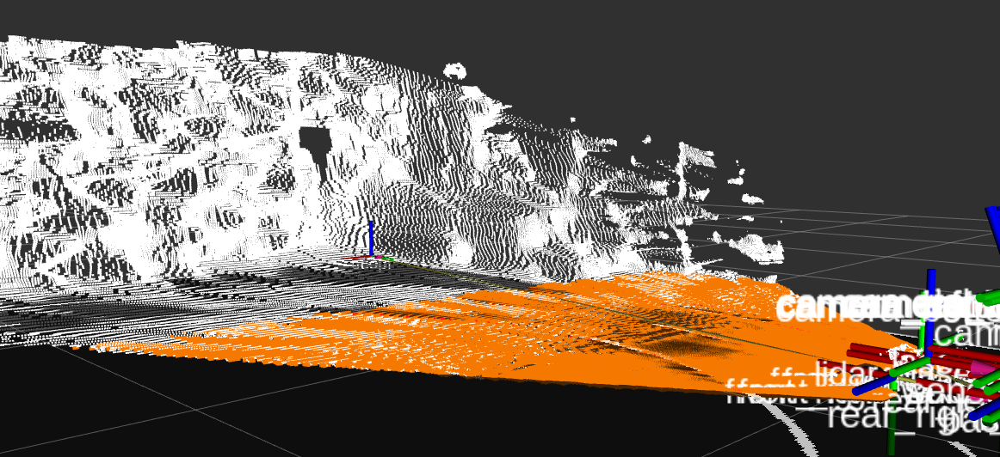

## Automatic camera pose estimation
The `stereo_camera_pose_estimation` node tries to find the stereo camera pose on the car. It uses the pointcloud and an aruco marker on the front to estimate the camera pose.

### Basic idea
We extract the ground plane from the pointcloud. The ground plane can be estimated using random sampling. We only sample points that are close to the car to increase accuracy. We assume that the car is always moving parallel to the ground plane. This way we can estimate the camera's roll, pitch and height from the ground plane:

From the ground plane estimation we got the description of the ground plane:

We can calculate the camera's roll and pitch:

)

)

Height above ground is given by:

Since we got a lot of points from the pointcloud roll and pitch are quite accurate.

We find the camera's yaw angle using the aruco marker on the front of the car. We use the color camera to detect the marker since it has a lower field of view which in return makes the marker appear bigger in the camera image than in the infrared ones. Make sure the camera is tilted (rolled) slightly to the ground plane so that the marker can be seen in the color image. Aruco markers can be used to get a 6-DOF pose relative to the marker. Since we know the marker's position on the car we can calculate the camera's position on the car. By default we only estimate the yaw angle using the marker but the marker can also be used to find the x y and z of the camera. The reason why we also use the ground plane is that the pose of the aruco marker can sometimes be noisy because the edges are not detected accurately. Another issue is that the estimated axis on the aruco markers sometimes are switched around and we can use the ground plane estimation to validate the pose from the marker.

After calculation is done the node broadcasts the transform from `camera_bottom_screw_frame` to `base_link` over tf.

### Example
Estimated ground plane (taken from `/sensors/camera/stereo_camera_pose_estimation/plane_pcl`):

Aruco marker and projected frame (taken from `/sensors/camera/stereo_camera_pose_estimation/marker`):
