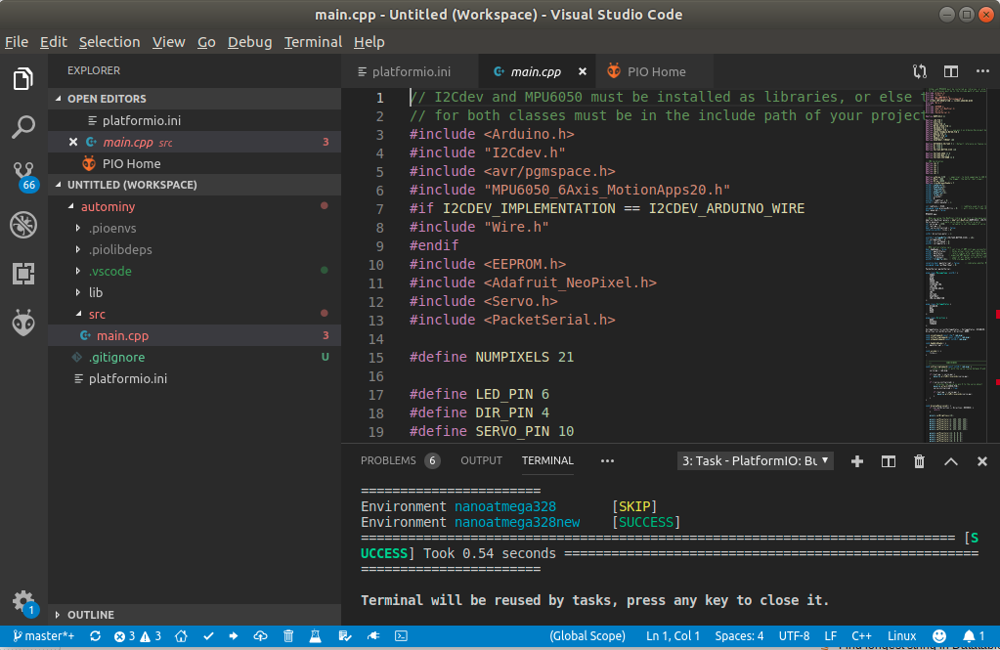

## Flashing the Arduino
The Arduino handles communication with the sensors and the odroid and does some basic safety checks. The firmware can be flashed via USB on a computer.

### Install Platform.io
The easiest way to flash the Arduino firmware is through Platform.io. Install Visual Studio Code along with the Platform.io plugin. There is a guide available at the [Platform.io website](https://platformio.org/platformio-ide). Open Visual Studio Code and on the PIO Home page select `Open Project` and select the `arduino/autominy` folder from the project folder.

### Flashing
Take the Arduino out of the car and connect it to the computer via USB. You should make sure to have write permissions on the Arduino device. On Ubuntu you can add your user to the `dialout` group which grants write permission on Arduino-like devices.

```bash
sudo usermod -a -G dialout $USER
```

Alternatively use `sudo chmod 777 /dev/ttyUSB0` to give write permissions temporarily.

Once connected, press the right facing arrow on the bottom in Visual Studio Code to compile and flash the code to the Arduino. If flashing fails with a sync error it is likely an Arduino version mismatch. By default the project is configured for the new Arduino Nano boards. The version can be changed in the platformio.ini file by setting `env_default` to `nanoatmega328new` (for the new boards) or `nanoatmega328` (for older boards).


