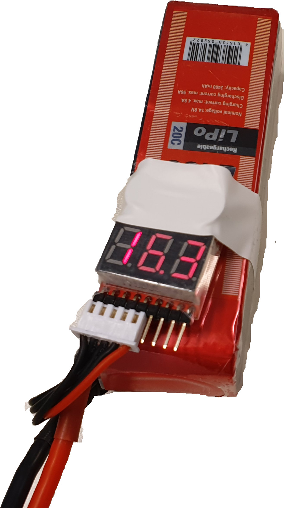

## Getting started

### Connect the battery
We use 14.8V (4 cells with 3.8V nominal voltage each) LiPo batteries to
power the car. Plug the battery voltage tester to the battery and check
that the voltage is above 14V. The LiPo battery's voltage may never drop
below 3.2V in any cell. The car will automatically shut down when the
voltage of the battery drops below 12.8V but it is always better to have
the battery voltage tester plugged in because it measures the voltage of
each cell separately. Keep in mind that discharging a cell below 3.2V
might destroy the battery and might explode when charging. Carefully
connect a 14.4V rated LiPo battery to the battery cable and fixate the
battery using the velcro stripe to the car.

 

### Startup
Switch the lever pointing towards the back of the car and press the
start button for at least 3 seconds. The car will now turn on and show
the battery level using the LEDs on the rear and back of the car.

Voltage indicator
* Green: > 14.8V
* Yellow: > 13.0V and < 14.8V
* Red: < 13.0V

The car will turn itself off at 12.8V to prevent any permanent damage to
the car but you should turn off the car immediately when the battery
voltage tester begins buzzing.

It takes about 10s until the odroid has booted and the car's software
starts up. Once the car has booted the LiDAR will start spinning.

### Connecting to the car
Each car is identified by it's number which is printed on the acrylic
plate. This number is used to connect to the car over the WiFi network.
By default the car's IP address is `192.168.43.[NUMBER]`. To confirm the
car is running simply try connecting via ssh with user `root` and the
password `elfmeter`:

```bash
ssh root@192.168.43.[NUMBER]
```

### Testing the actuators
Now you can try to steer and drive the car. Place the car on a box and
run:

Driving the car at a speed level of 0.2:
```bash
rostopic pub /control/command/normalized_wanted_steering autominy_msgs/NormalizedSteeringCommand "header:
  seq: 0
  stamp:
    secs: 0
    nsecs: 0
  frame_id: ''
value: 0.2"
```

Setting the steering angle fully to the left:
```bash
rostopic pub /control/command/normalized_wanted_steering autominy_msgs/NormalizedSteeringCommand "header:
  seq: 0
  stamp:
    secs: 0
    nsecs: 0
  frame_id: ''
value: 1.0"
```

