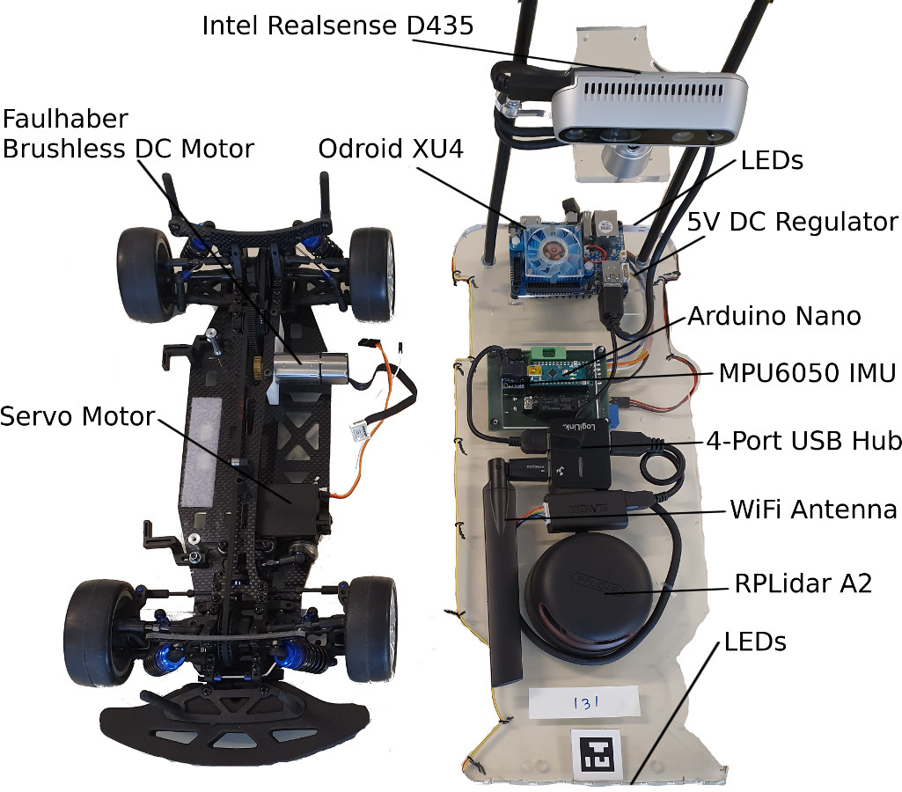

## Hardware

“Autominy” is a model vehicle (scale 1:10) developed for educational purposes. The car can be controlled using a cellular phone or can be programmed to drive in fully autonomous mode. The main computer is an Odroid XU4 running Ubuntu 18.04 Linux and the Robotic Operating System (ROS) on top. The chassis of the vehicle comes from the model-car building community. The vehicle has been motorized with a Brushless DC-Servomotor FAULHABER 2232. Steering is done through a servo motor Adafruit 1404 . See Fig. 1 for the details of the assembled unit.

Electronics and sensors are arranged in one layer. Fig 1 shows the sensor layer. The sensors in the vehicle are a rotating laser scanner (RPLIDAR A2) which provides detection of obstacles around the vehicle. A Kinect-type stereoscopic system (Intel RealSense D435) is mounted on top of the car’s body. The Realsense camera provides a pointcloud that can be used to detect obstacles. The video camera in the Kinect-type sensor can be used to detect the lane and objects in front of the car. The Odroid board is the main computer. The sensors are either connected through the USB-Hub ports to the Odroid board or directly to Odroid's USB 3.0 ports.

The car has 2 LED stripes (WS2812b) for simulating the head and tail lights, as well as blinkers and break lights. Fig. 2 shows the main connections between the different electronic modules. The brushless motor,servo motor, MPU6050, plus the LED stripes are connected to an Arduino Nano. The MPU6050, provides measurements from accelerometers and gyroscopes, that can be used to complement the odometry and also to measure the vehicle’s rotation. The MPU6050 is controlled by an Arduino Nano board through the I2C pin. The Arduino Nano board is connected to the Odroid through USB.