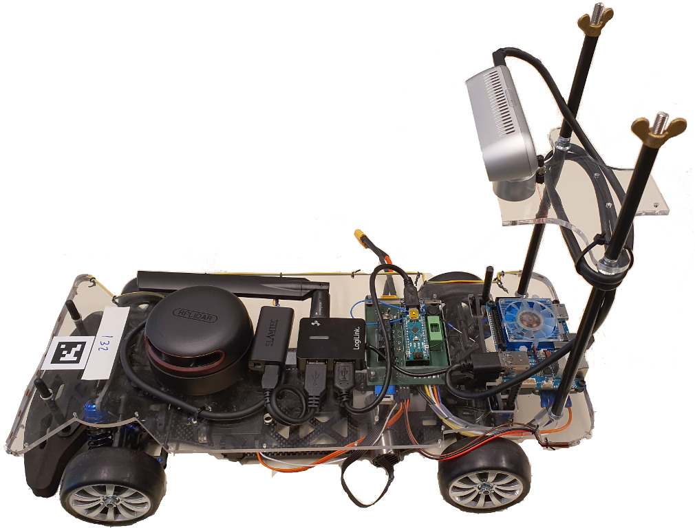

## Autominy 4.0

Our “Autominy” cars are model vehicle (scale 1:10) developed at the
Freie Universität Berlin for educational purposes. The car can be
controlled remotely (e.g. with a smartphone or XBox controller) or can
be programmed to drive in fully autonomous mode. The cars run on ROS
melodic on Ubuntu 18.04.

### Overview

* [Getting started](getting-started.md)
* [Setting up ROS and the project](ros.md)
* [Hardware](hardware.md)
* Flashing the Arduino
* Calibration
