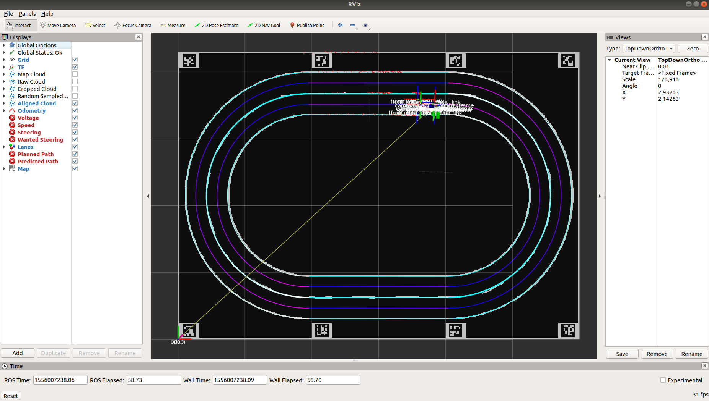

## Visualize sensor data
On your computer run `rviz` and open `live.rviz` from `src/autominy/rviz` in your `catkin_ws`. You should be seeing something like this:

The default view does visualize the most important sensor data. We do not visualize camera images by default since they consume quite a lot of bandwidth. Doing so could cause issues with the wifi network due to bandwidth shortage.

### Compiling additional rviz plugins
There are rviz plugins available to visualize `autominy_msgs`. These are not available by default because they would break compilation on the car due to the rviz dependency which is not installed on the car. If you want to compile these remove the CATKIN_IGNORE file from the `jsk_rviz_plugin` (visualizes steering angle and speed, and some more) and `trajectory_msgs_rviz_plugin` (visualizes trajectory) folders and rebuild the catkin workspace.